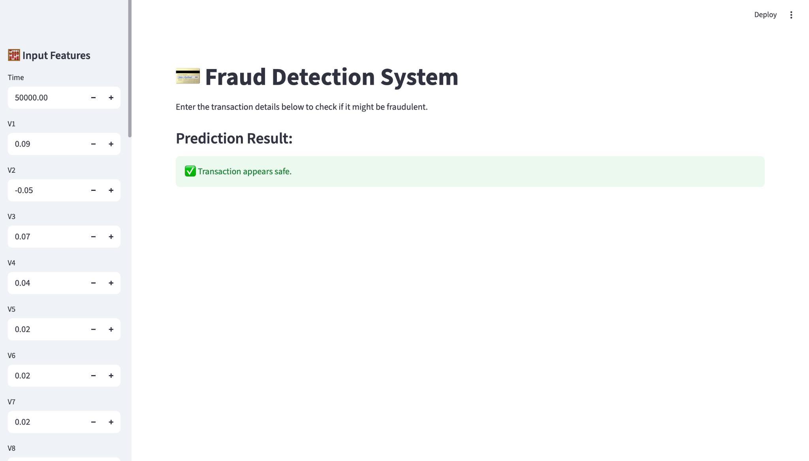

# 💳 Fraud Detection System

A Machine Learning–powered Fraud Detection Web App built using Streamlit, Scikit-Learn, and Python.  
This system helps detect whether a given financial transaction is **fraudulent or safe** based on transaction features.

---

## 🚀 Project Overview

This project demonstrates how to build an **end-to-end fraud detection system**:
1. **Model Training** using a Random Forest Classifier.
2. **Feature Scaling** using StandardScaler.
3. **Model Saving & Loading** using `joblib`.
4. **Interactive Streamlit Web App** to predict real-time fraud detection results.

---

## 🧠 Machine Learning Model

- **Algorithm:** Random Forest Classifier  
- **Dataset Used:** `fraud_data.csv`  
- **Target Variable:** `Class` (1 = Fraud, 0 = Safe)  
- **Feature Count:** 30 (including V1–V28, Time, Amount)

The model is trained on scaled transaction features and serialized as:
- `model/fraud_model.pkl`  
- `model/scaler.pkl`

---

## 🖥️ Streamlit Web App Preview

Below is the user interface of the Fraud Detection System:



> The interface allows you to input 30 transaction features and instantly predicts whether the transaction is **fraudulent** or **safe**.

---

## ⚙️ Installation and Setup

### 1️⃣ Clone the Repository
```bash
git clone https://github.com/<your-username>/fraud-detection.git
cd fraud-detection
2️⃣ Create Virtual Environment
python3 -m venv .venv
source .venv/bin/activate
3️⃣ Install Dependencies
pip install -r requirements.txt
4️⃣ Run the Streamlit App
streamlit run Fraud_detection_app.py
The app will automatically open in your browser at:
👉 http://localhost:8501
📁 Project Structure
FRAUD-DETECTION/
│
├── model/
│   ├── fraud_model.pkl
│   └── scaler.pkl
│
├── fraud_data.csv
├── Fraud_detection_app.py
├── Fraud_detection_converted.py
├── requirements.txt
├── .gitignore
├── README.md
└── images/
    └── fraud_detection_ui.png
🧩 Requirements
streamlit
pandas
numpy
scikit-learn
joblib
📊 Example Prediction
Feature	Example Value
Time	50000
V1–V28	Various
Amount	200.5
Output	✅ Transaction appears safe
💡 Real-Life Application
This model can be applied in:
Online Payment Gateways (UPI, Credit/Debit Card)
Banking Transaction Monitoring
E-commerce Payment Fraud Prevention
FinTech Risk Analysis
